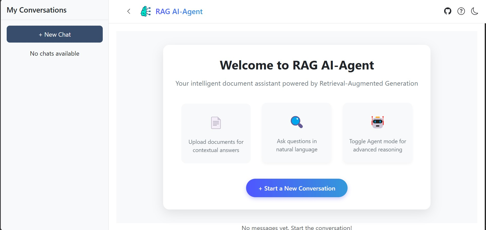
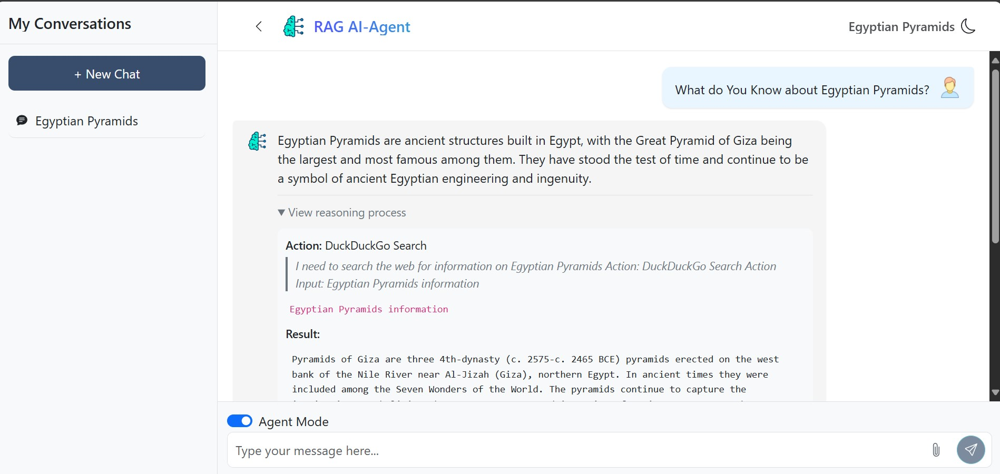
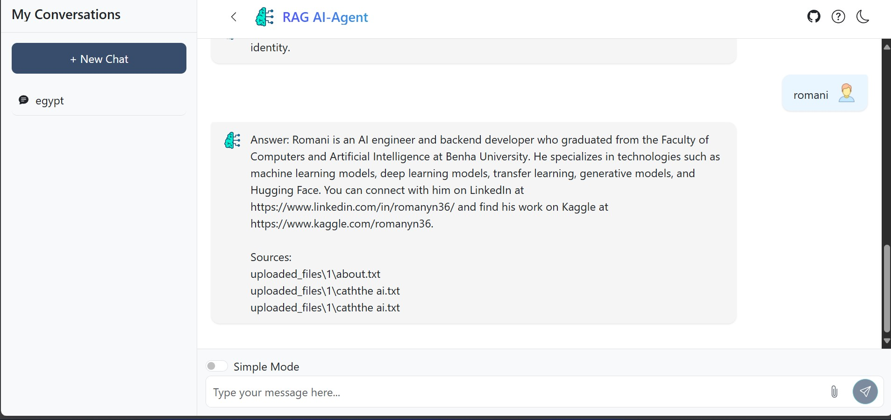
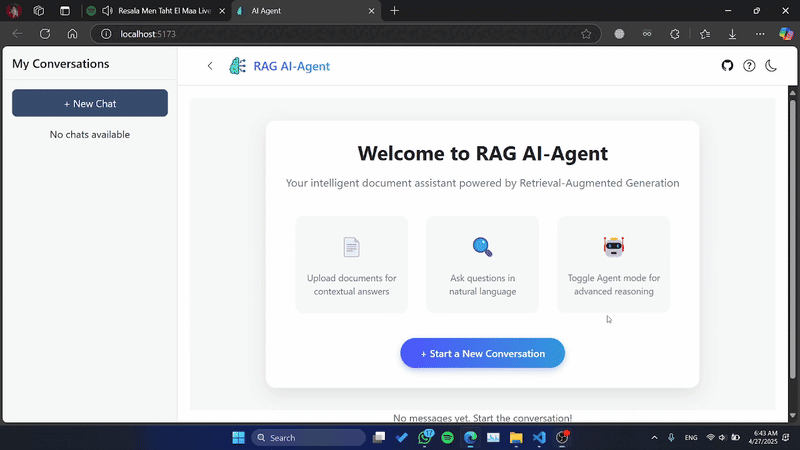

<div align="center" id="top"> 
  
  &#xa0;
</div>
<h1 align="center">RAG AI-Agent</h1>
<div align="center" id="top" class="flex">
  
  <div style="display: flex; justify-content: center; gap: 20px; flex-wrap: wrap;">
    
    
  </div>
  &#xa0;
</div>
<!-- demo -->
<div align="center">
  
</div>


<p align="center">
  
  
  
  
</p>

<p align="center">
  <a href="#dart-about">About</a> &#xa0; | &#xa0; 
  <a href="#sparkles-features">Features</a> &#xa0; | &#xa0;
  <a href="#rocket-technologies">Technologies</a> &#xa0; | &#xa0;
  <a href="#architecture">Architecture</a> &#xa0; | &#xa0;
  <a href="#white_check_mark-requirements">Requirements</a> &#xa0; | &#xa0;
  <a href="#checkered_flag-starting">Starting</a> &#xa0; | &#xa0;
  <a href="#memo-license">License</a> &#xa0; | &#xa0;
  <a href="#heart-contact-me">Contact</a>
</p>

<br>

## :dart: About

**RAG AI-Agent** is an intelligent question-answering system built on Retrieval-Augmented Generation technology. It allows users to have conversational interactions with their documents by uploading files (PDFs, TXTs, etc.), which are then semantically parsed, indexed, and made available for natural language queries. The system dynamically retrieves relevant information from the documents to generate accurate, contextual responses.

This project combines a FastAPI backend with a React frontend to create a seamless chat-based interface. Users can choose between a simple RAG mode or an advanced Agent mode that uses reasoning and tools like calculators and web search to extend the system's capabilities.

---

## :sparkles: Features

### **Core Capabilities:**
- **Document Processing:** Upload and process PDF, TXT, and DOCX files
- **Semantic Search:** Find relevant information within your documents using natural language queries
- **RAG-based Responses:** Generate contextual answers by combining retrieved information with AI capabilities
- **Chat Interface:** Intuitive conversation-based UI with chat history management(rename, delete, and save conversations)

### **Agent Mode:**
- **Step-by-step Reasoning:** View the agent's thought process and steps taken to answer complex questions
- **Tool Integration:** Access to calculator, current time, and web search tools
- **Transparent Decision Making:** See exactly how the agent formulates responses

### **File Management:**
- **Document Upload:** Upload documents directly in chat conversations
- **Vector Storage:** Efficient retrieval using semantic vector embeddings
- **Context Preservation:** Documents are linked to specific conversations

### **Chat Features:**
- **Chat History:** Save and load conversation history
- **Chat Management:** Create, rename and delete conversations
- **User-friendly Interface:** Clean, responsive design with intuitive controls
- **Dark Mode:** Toggle between light and dark themes for better readability

---

## :rocket: Technologies

<div align="center">
    
    
    
    
    
    
    
    
    
   
    
    

  

    
    
 

</div>

The following tools and frameworks were used in this project:

- **Backend:**
  - [FastAPI](https://fastapi.tiangolo.com/) - Modern, high-performance web framework for building APIs
  - [LangChain](https://langchain.com/) - Framework for developing applications powered by language models
  - [ChromaDB](https://www.trychroma.com/) - Vector database for storing and retrieving embeddings
  - [SQLite](https://www.sqlite.org/) - Database for storing chat and message information
  - [OpenAI](https://openai.com/) - Language models and embedding generation
  - [SQLAlchemy](https://www.sqlalchemy.org/) - SQL toolkit and Object-Relational Mapping
  

- **Frontend:**
  - [React](https://reactjs.org/) - A JavaScript library for building user interfaces
  - [React Bootstrap](https://react-bootstrap.github.io/) - Bootstrap components built with React
  - [React Router](https://reactrouter.com/) - Routing for React applications
  - [Axios](https://axios-http.com/) - Promise-based HTTP client
  - [React Icons](https://react-icons.github.io/react-icons/) - Popular icons for React projects
  - [React Toastify](https://fkhadra.github.io/react-toastify/) - Toast notifications for React
  - [Vite](https://vitejs.dev/) - Next generation frontend tooling

- **Document Processing:**
  - [PyPDF](https://pypdf2.readthedocs.io/) - PDF processing
  - [Unstructured](https://unstructured.io/) - Document parsing (markdown, etc.)
  - [LangChain Document Loaders](https://js.langchain.com/docs/modules/data_connection/document_loaders/) - Various document loading utilities

## Architecture

The application follows a client-server architecture with the following components:

1. **Frontend (React):**
   - Chat interface with conversation management
   - File upload functionality
   - Agent mode toggle
   - Reasoning step visualization

2. **Backend (FastAPI):**
   - API endpoints for chat and message management
   - Document processing pipeline
   - Vector database integration
   - Agent execution logic

3. **Vector Database (ChromaDB):**
   - Stores document embeddings
   - Enables semantic search for relevant content

4. **Agent System:**
   - Retrieves relevant context from the vector database
   - Uses tools like calculator, web search, and date-time
   - Generates responses with reasoning steps

5. **Data Storage:**
   - SQLite database for storing chat history and messages
   - File system for document storage

---

## :white_check_mark: Requirements

Before starting, ensure you have the following installed:

- Python 3.11
- Node.js 16+ and npm
- OpenAI API key
- Git

---

## :checkered_flag: Starting

```bash
# Clone this project
$ git clone https://github.com/romanyn36/RAG-AI-Agent.git

# Navigate to the project directory
$ cd RAG-AI-Agent

# Create a virtual environment
$ python -m venv venv

# Activate the virtual environment
$ source venv/bin/activate  # For Linux/Mac
$ venv\Scripts\activate     # For Windows

# Install backend dependencies
$ pip install -r requirements.txt

# Create a .env file with your OpenAI API key
$ echo "OPENAI_API_KEY=your_api_key_here" > .env

# Start the backend server
$ uvicorn app:app --reload

# In a separate terminal, navigate to the frontend directory
$ cd agent-frontend

# Install frontend dependencies
$ npm install
# set the environment variable for the backend URL
$ echo "VITE_API_URL=http://127.0.0.1:8000" > .env

# Start the development server
$ npm run dev

# The frontend will be available at http://localhost:5173
# The backend API will be available at http://localhost:8000
```

## Configuration

You can adjust the following settings:

1. In `vector_database.py`:
   - Change `chunk_size` and `chunk_overlap` for document splitting
   - Adjust `similarity_threshold` for relevance filtering

2. In `agent.py`:
   - Modify `PROMPT_TEMPLATE` to change how responses are generated
   - Add or remove tools from the agent

## :memo: License

This project is licensed under the MIT License. For more details, see the [LICENSE](LICENSE) file.

## :heart: Contact Me

- Made by Romani – an AI Engineer and Backend Developer. Feel free to reach out for collaborations, questions, or new projects!
You can contact me via email:
  <a href="mailto:romani.nasrat@gmail.com">
    romani.nasrat@gmail.com
  </a>

- You can also find me on:
<div align="center">
  <a href="https://www.linkedin.com/in/romaninasrat/" target="_blank">
    
  </a>
  <a href="https://x.com/RomaniNasrat" target="_blank">
    
  </a>
  <a href="romani.nasrat@gmail.com" target="_blank">
    
  </a>
  <a href="https://t.me/romanyn36" target="_blank">
    
  </a>
  <a href="https://github.com/romanyn36" target="blank"></a>
   <a href="https://kaggle.com/romanyn36" target="blank"></a>


</div>

<a href="#top">Back to top</a>


